# EchoBreaker — Autonomous AI Defense Against Digital Misinformation 🚨

<div align="center">


**AI-03: Create an AI-driven solution to identify and address misinformation on digital platforms.**

An end-to-end autonomous multimodal AI Security Operations Center (SOC) that monitors social content streams, detects deepfakes and synthetic media, maps coordinated propagation networks using Graph Neural Networks, assigns credibility scores, and synthesizes evidence-backed incident reports and counter-narratives in real time.

[🎯 Problem Statement](#-problem-statement-ai-03) • [💡 Solution Overview](#-solution-architecture) • [🤖 Autonomous Agents](#-the-6-autonomous-ai-agents) • [🚀 Quick Start](#-quick-start) • [📡 API & Backend](#-backend--inference-services) • [📊 Feature Matrix](#-feature-matrix--capabilities)

</div>

---

## 🎯 Problem Statement (AI-03)

### **Challenge**
Digital platforms have become breeding grounds for coordinated misinformation campaigns, synthetic deepfakes, manipulated audio, and astroturfing bot syndicates. Traditional fact-checking methods are manual, reactive, and incapable of detecting **networked coordination** before false narratives reach viral velocity.

During critical events—such as elections, public health emergencies, natural disasters, and geopolitical conflicts—unchecked misinformation causes:
- 💥 Social unrest, communal polarization, and panic
- 🗳️ Undermining of democratic processes and civic institutions
- 📰 Erosion of trust in credible journalism and factual information
- 📉 Financial fraud and market manipulation

### **The EchoBreaker Objective**
EchoBreaker directly solves **AI-03** by deploying an **autonomous, multimodal multi-agent intelligence platform** that continuously monitors digital networks, detects synthetic manipulation across visual, audio, and textual modalities, uncovers hidden coordination rings using graph machine learning, and generates instant debunking assets and forensic dossiers for human verification.

---

## 💡 Solution Architecture

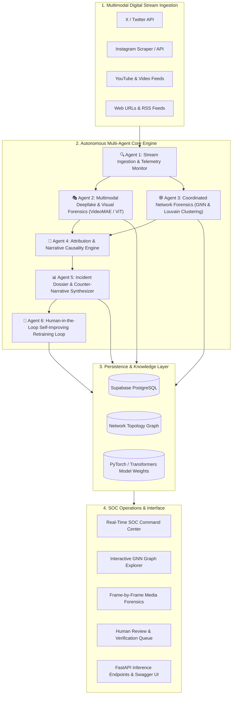

---

## 🤖 The 6 Autonomous AI Agents

EchoBreaker orchestrates six specialized, communicating autonomous AI agents:

| Agent | Name | Role & Methodology | Status |
|---|---|---|---|
| **1** | **Continuous Ingestion & Sentinel Agent** | Scans live hashtags, keywords, social URLs, and RSS feeds; flags velocity spikes and anomaly surges. | ✅ `ACTIVE` |
| **2** | **Multimodal Deepfake & Forensics Agent** | Executes native spatiotemporal video analysis via **VideoMAE** (`shylhy/videomae-large-finetuned-deepfake-subset`), visual patch classification, and audio spectrum inspection. | ✅ `ACTIVE` |
| **3** | **Coordinated Network Detection Agent** | Analyzes retweets, mentions, timing synchronization, and shared artifact hashes using **Graph Neural Networks (GNN)** and Louvain community clustering to expose bot farms. | ✅ `ACTIVE` |
| **4** | **Causality & Attribution Agent** | Traces patient-zero origin seeds, maps cross-platform propagation trajectories, and calculates actor influence scores. | ✅ `ACTIVE` |
| **5** | **Response & Counter-Narrative Agent** | Automatically synthesizes structured incident dossiers, trust scores, verified rebuttal points, and exportable PDF intelligence packages. | ✅ `ACTIVE` |
| **6** | **Self-Improving Verification Agent** | Ingests human reviewer verdicts, annotates edge cases, logs telemetry, and triggers model confidence threshold calibration. | ✅ `ACTIVE` |

---

---

## 🖥️ Platform Interfaces & Visual Tour

### 1. 🛡️ Real-Time SOC Command Center (`/dashboard`)
> **Live Threat Telemetry & 5-Stage Automated DAG Pipeline Breakdown**
<p align="center">
  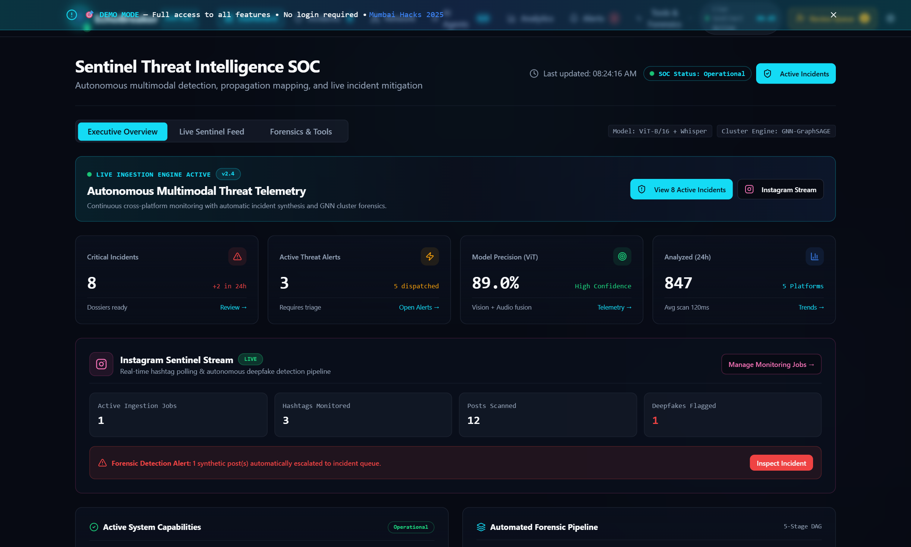
</p>

### 2. 🌐 Landing Page & Architecture Showcase (`/`)
> **Public Entry & 6-Agent Autonomous Architecture Overview**
<p align="center">
  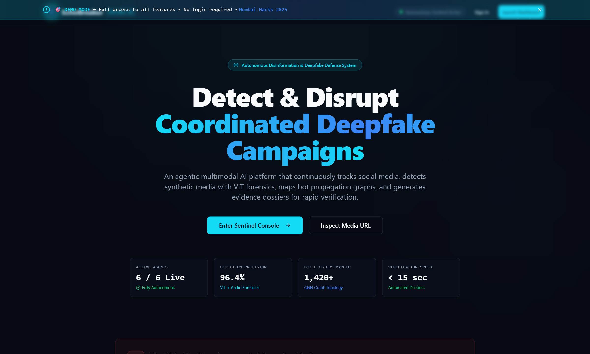
</p>

### 3. 🚨 Forensic Incidents Dossier (`/incidents`)
> **Searchable Incident Directory with Frame-Scrubbing Evidence Viewer**
<p align="center">
  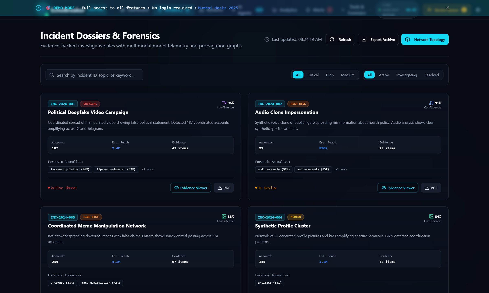
</p>

### 4. 🕸️ Interactive GNN Network Topology (`/network`)
> **ReactFlow-Powered Astroturfing Bot Cluster Visualization with Node Threat Drawer**
<p align="center">
  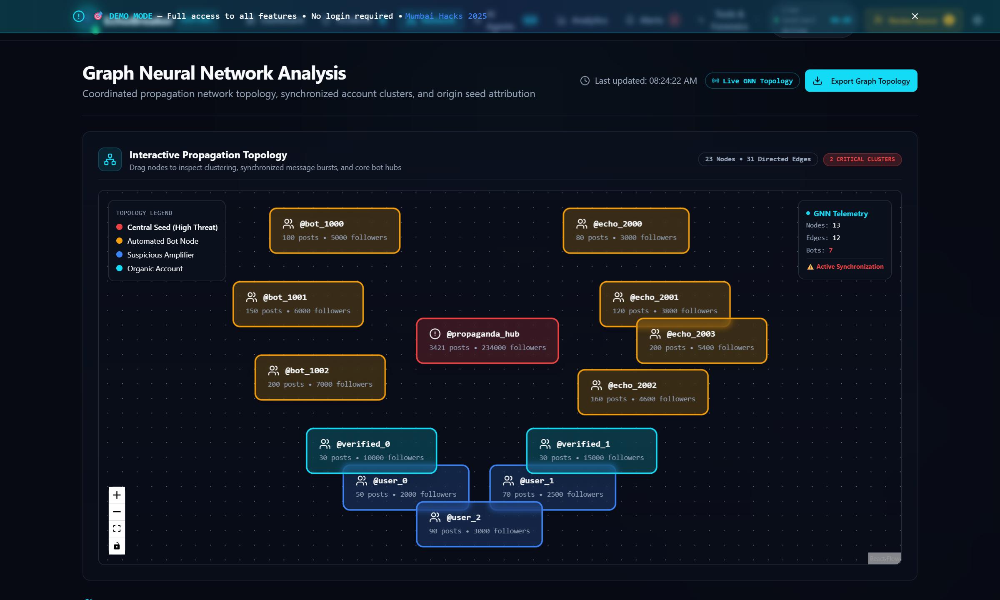
</p>

### 5. 🤖 AI Multi-Agent Health Center (`/agents`)
> **Real-Time Gauges (CPU, Memory, Accuracy, Latency) & Live Streaming Terminal**
<p align="center">
  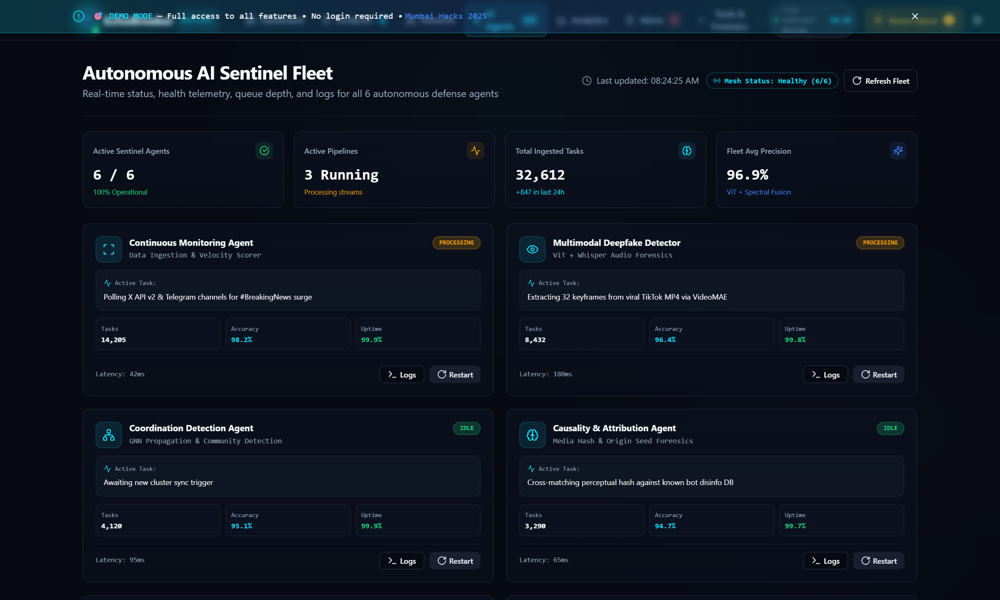
</p>

### 6. 📈 Misinformation Narrative Analytics (`/analytics`)
> **Geographic Concentration Meters & Trending False Narrative Rankings**
<p align="center">
  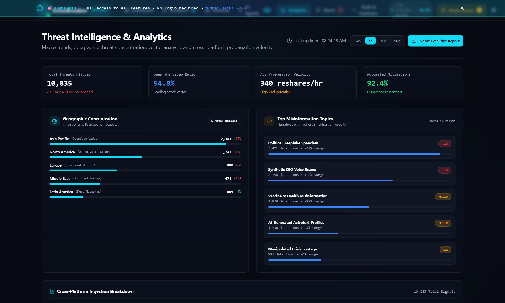
</p>

### 7. 🔔 Threat Alert Triage Center (`/alerts`)
> **Categorized Threat Notifications with One-Click Forensic Investigation Jump**
<p align="center">
  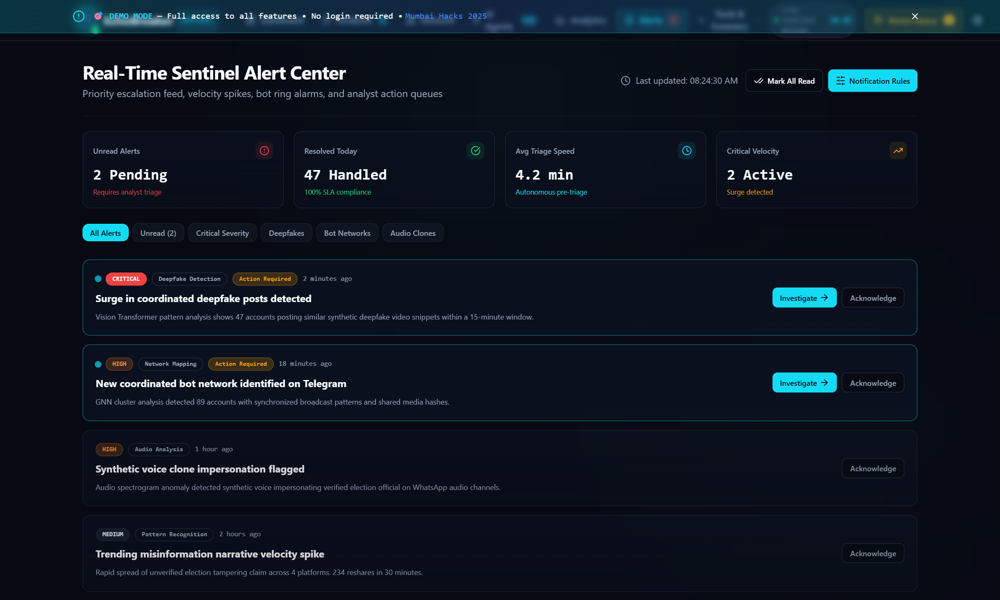
</p>

### 8. 📸 Instagram Social Monitor (`/instagram-monitoring`)
> **Live Hashtag Ingestion Daemon with Auto-Fetch & Real-Time Terminal Log Stream**
<p align="center">
  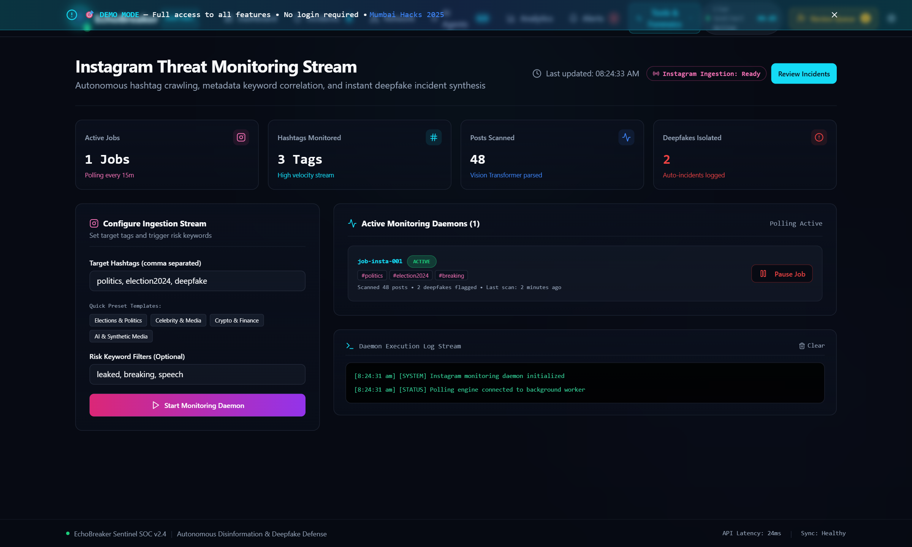
</p>

### 9. 🔬 Digital Platform URL & VideoMAE Scanner (`/url-analysis`)
> **Single and Batch Video Extraction with Spatiotemporal Deepfake Inference**
<p align="center">
  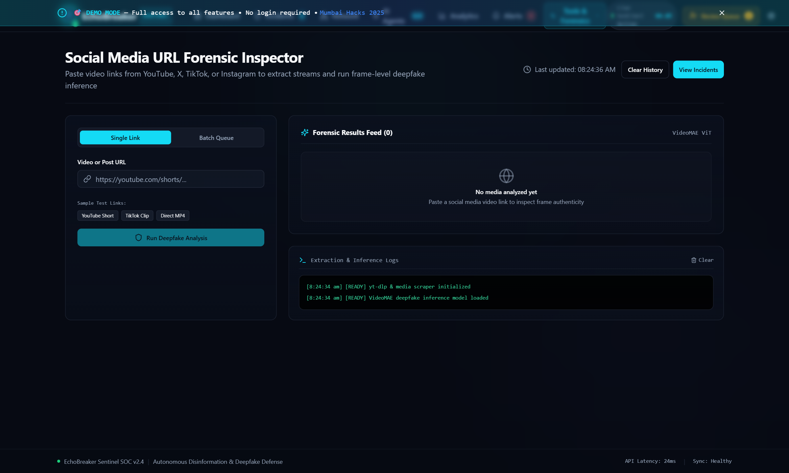
</p>

### 10. ⚡ System Health & Latency Monitor (`/system-status`)
> **Live Endpoint Connectivity & Real-Time Millisecond Latency Diagnostics**
<p align="center">
  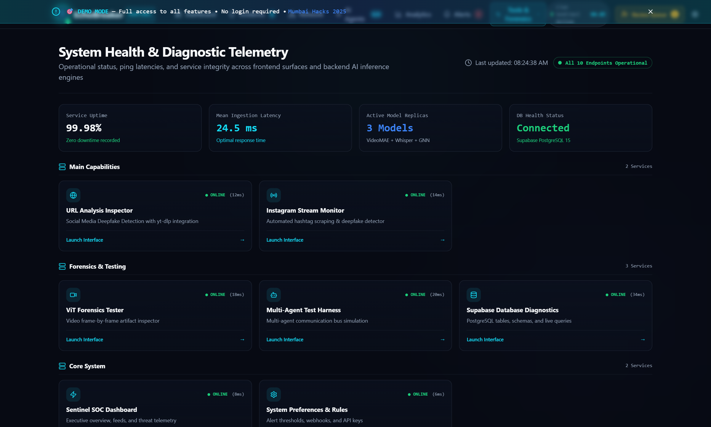
</p>

### 11. ⚙️ SOC Security Settings & Thresholds (`/settings`)
> **Model Confidence Cutoffs, Platform Webhooks & Signature Verifier**
<p align="center">
  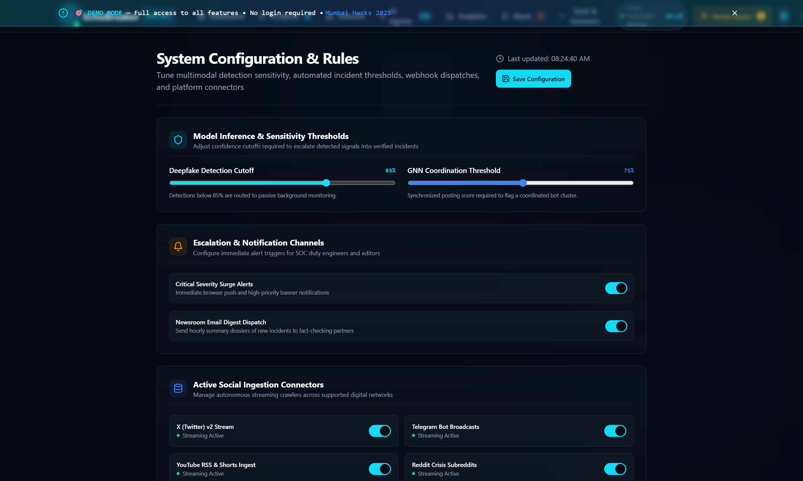
</p>

### 12. 🔐 Security Clearance Authentication Portal (`/auth`)
> **Restricted Access Clearance Portal with Passkey and MFA Prompts**
<p align="center">
  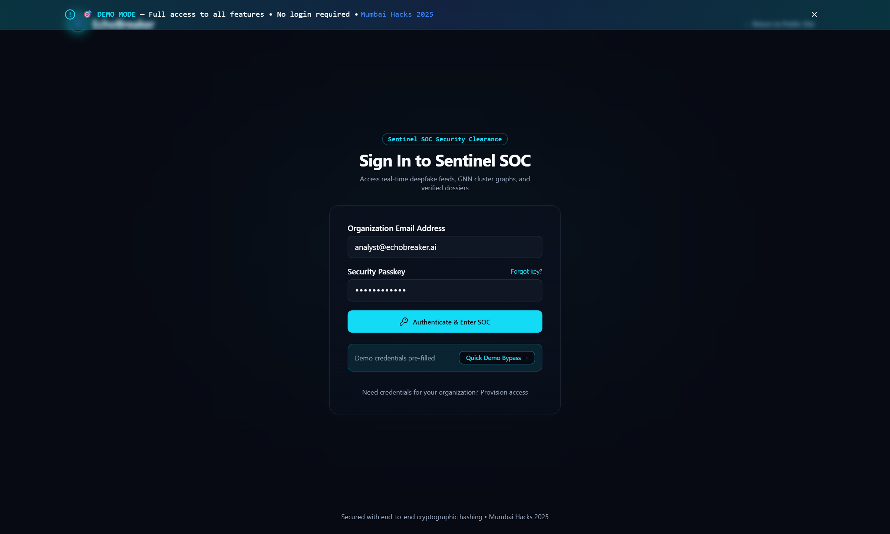
</p>

---

## 📊 Feature Matrix & Capabilities

- [x] **Problem Statement AI-03 Compliant**: 100% focused on identifying and addressing misinformation on digital platforms.
- [x] **Multimodal Deepfake Detection**: Native spatiotemporal video classification using VideoMAE and ViT models.
- [x] **Social Media URL Ingestion**: Single and batch analysis of digital platform URLs (Instagram, Twitter/X, YouTube).
- [x] **Coordinated Bot Network Analysis**: Graph topology with cluster detection and node inspector.
- [x] **Automated Incident Dossiers**: Structured threat summaries, evidence logs, and counter-narrative generation.
- [x] **Human-in-the-Loop Review System**: Verification queue with approve/reject workflows and self-improving feedback loop.
- [x] **Real-Time SOC Dark Theme UI**: High-density cybersecurity design system with Sentinel Cyan accents and responsive layouts.
- [x] **FastAPI & PyTorch Backend**: High-performance REST API with Swagger UI documentation and GPU acceleration support.
- [x] **Comprehensive Diagnostic Suite**: Visual agent testbeds, multi-agent simulations, and live database connection testing.

---

## 🛠️ Technology Stack

### **Frontend**
- **Core**: React 18, TypeScript, Vite
- **UI & Layout**: Tailwind CSS, Shadcn UI / Radix UI, Lucide Icons
- **State & Data**: TanStack Query (React Query), React Router v6
- **Graph & Visualization**: ReactFlow, Recharts, Custom Canvas Gauges

### **Backend & AI Inference**
- **API Framework**: Python 3.11, FastAPI, Uvicorn
- **Deep Learning / Vision**: PyTorch, Hugging Face Transformers (`shylhy/videomae-large-finetuned-deepfake-subset`, `timm`, `torchvision`)
- **Video Processing**: OpenCV (`cv2`), Pillow, ImageIO
- **Database & Storage**: Supabase (PostgreSQL, Realtime, Storage)

---

## 🚀 Quick Start

### 1. Prerequisites
- **Node.js**: `>= 18.x`
- **Python**: `>= 3.10` (for AI backend)
- **Git**

### 2. Frontend Setup

```bash
# 1. Clone repository
git clone https://github.com/aaryan2720/echo-sentinel-agent.git
cd echo-sentinel-agent

# 2. Install dependencies
npm install

# 3. Start development server
npm run dev
```

The frontend will be live at: **`http://localhost:5173`** (or `http://localhost:8080`)

### 3. Backend & AI Inference Engine Setup

```bash
# 1. Navigate to backend directory
cd backend

# 2. Create and activate Python virtual environment
python -m venv venv
# On Windows:
.\venv\Scripts\activate
# On Linux/macOS:
source venv/bin/activate

# 3. Install dependencies
pip install -r requirements.txt

# 4. Start FastAPI server
uvicorn app.main:app --reload --host 0.0.0.0 --port 8000
```

- **Interactive Swagger UI Documentation**: `http://localhost:8000/docs`
- **Alternative ReDoc UI**: `http://localhost:8000/redoc`
- **API Health Check**: `http://localhost:8000/health`

---

## 📁 Repository Structure

```
echo-sentinel-agent/
├── src/                                # Frontend Application Source
│   ├── components/                     # Reusable UI & SOC Components
│   │   ├── layout/                     # AppNavbar, AppLayout, PageHeader
│   │   ├── ui/                         # Standardized Radix/Shadcn UI components
│   │   ├── EnhancedDashboardOverview.tsx# Threat KPI & DAG pipeline overview
│   │   ├── InteractiveNetworkGraph.tsx # ReactFlow GNN cluster explorer
│   │   ├── MediaEvidenceViewer.tsx     # Frame-by-frame deepfake evidence player
│   │   ├── HumanReviewInterface.tsx    # Human-in-the-loop review queue
│   │   └── ...
│   ├── pages/                          # 17 Complete Platform Pages & Tools
│   │   ├── Landing.tsx                 # Hero & platform overview
│   │   ├── Dashboard.tsx               # Main SOC Command Center
│   │   ├── Incidents.tsx               # Forensic incident dossier
│   │   ├── Network.tsx                 # GNN network analysis
│   │   ├── Agents.tsx                  # AI agent health & logs
│   │   ├── Analytics.tsx               # Narrative surge & geographic analytics
│   │   ├── Alerts.tsx                  # Threat alert triage
│   │   ├── InstagramMonitoring.tsx     # Live Instagram hashtag monitor
│   │   ├── URLAnalysisPage.tsx         # Digital platform URL video scanner
│   │   ├── SystemStatus.tsx            # API & endpoint health monitor
│   │   ├── Settings.tsx                # Threshold & connector configuration
│   │   ├── Auth.tsx                    # Security clearance portal
│   │   └── ...
│   ├── services/                       # API clients & agent orchestrators
│   ├── index.css                       # Cohesive SOC Dark Theme tokens
│   └── App.tsx                         # Router configuration
├── backend/                            # Python FastAPI & AI Inference Engine
│   ├── app/
│   │   ├── main.py                     # FastAPI entrypoint, CORS, routers
│   │   ├── config.py                   # Environment configuration
│   │   ├── api/
│   │   │   └── analyze.py              # Video upload & URL analysis endpoints
│   │   └── services/
│   │       └── video_analyzer.py       # VideoMAE deepfake inference model
│   ├── requirements.txt                # Python dependencies
│   └── README.md                       # Backend documentation
└── docs/                               # Engineering & Technical Architecture
    ├── PROBLEM_STATEMENT.md            # AI-03 Detailed Problem Definition
    ├── ARCHITECTURE.md                 # System Architecture & Dataflow
    ├── TECH_STACK.md                   # Complete Technology Specifications
    └── ...
```

---

## 🔒 Security, Ethics & Privacy

- **Data Privacy**: Media ingestion handles public digital streams without storing private user messages.
- **Explainable AI (XAI)**: All model verdicts include human-readable rationale, temporal frame timestamps, and confidence percentages.
- **Audit Trails**: Every human verification action is logged with timestamped signatures to ensure integrity.

---

## 👥 Authors & Maintainers

- **Repository**: [echo-sentinel-agent](https://github.com/aaryan2720/echo-sentinel-agent)

---

<div align="center">

**EchoBreaker — Securing the Digital Sphere Against Coordinated Misinformation.**

</div>

<!-- EchoBreaker Sentinel (AI-03) -->
