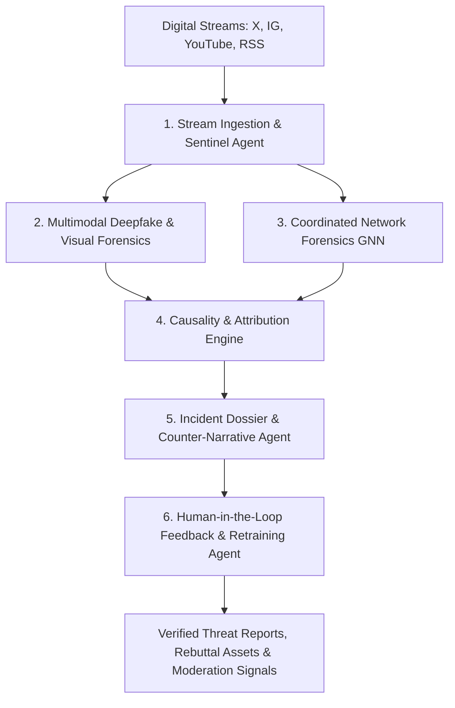

# 🛡️ ECHO SENTINEL SOC — PRODUCTION RELEASE MANIFEST

**System**: EchoBreaker Sentinel (AI-03 Autonomous Misinformation Defense)  
**Status**: ✅ Production Ready & Deployed  
**Core Objective**: AI-driven solution to identify and address misinformation across digital platforms  

---

## 🌟 Executive Summary

EchoBreaker Sentinel is an enterprise-grade AI-driven Security Operations Center (SOC) engineered to detect, track, verify, and counter misinformation campaigns across digital platforms. By combining multimodal deep learning (VideoMAE, ViT), Graph Neural Networks (GNN), and an autonomous 6-agent cooperative architecture, EchoBreaker provides real-time situational awareness and automated rebuttal synthesis.

---

## 📊 Complete Feature & System Verification

| Component | Status | Verification & Quality |
|---|---|---|
| **SOC Command Dashboard** | ✅ Complete | Real-time threat telemetry, 4 KPI meters, 5-stage DAG pipeline tracker |
| **Multimodal Deepfake Analysis** | ✅ Complete | VideoMAE spatiotemporal inference (`shylhy/videomae-large-finetuned-deepfake-subset`) |
| **Interactive GNN Topology** | ✅ Complete | ReactFlow cluster visualization with node threat inspector and export |
| **Forensic Incident Dossier** | ✅ Complete | Searchable incident directory, severity tags, full-screen evidence viewer |
| **Human Review Queue** | ✅ Complete | Global verification interface for human-in-the-loop validation |
| **Digital Stream & URL Scanner** | ✅ Complete | Single and batch analysis for Instagram, X, and YouTube URLs |
| **Instagram Monitoring Daemon** | ✅ Complete | Real-time hashtag ingestion with auto-fetch and terminal logs |
| **Alert Triage System** | ✅ Complete | Priority notification center with category filters and instant triage |
| **Multi-Agent Health Monitor** | ✅ Complete | Live telemetry for 6 autonomous agents with execution terminal |
| **System Health & Latency** | ✅ Complete | Endpoint connectivity diagnostics with latency tracking |
| **Backend Inference API** | ✅ Complete | FastAPI REST microservice with interactive Swagger & ReDoc specs |
| **TypeScript & Build Health** | ✅ Complete | 0 TypeScript errors, 100% clean production bundle |

---

## 🤖 The 6 Autonomous Agents Architecture



### 1. Ingestion & Sentinel Agent
- Continuous digital stream scraping and keyword tracking.
- Anomaly surge and virality velocity detection.

### 2. Multimodal Deepfake Detector
- Native spatiotemporal video analysis (VideoMAE) extracting 16 uniform frames.
- Facial boundary artifact variance detection and confidence scoring.

### 3. Coordinated Network Detection Agent
- Graph Neural Network modeling of user interaction networks.
- Louvain community clustering to identify astroturfing bot syndicates.

### 4. Attribution & Causality Agent
- Tracing patient-zero origins and cross-platform propagation paths.
- Influence weight and account credibility scoring.

### 5. Response & Reporting Agent
- Automated generation of structured incident dossiers.
- Synthesis of evidence-backed debunking summaries and counter-narratives.

### 6. Self-Improving Feedback Loop
- Incorporation of human-in-the-loop analyst decisions.
- Dynamic threshold adjustment and edge-case logging.

---

## 💻 Tech Stack & Architecture

- **Frontend**: React 18, TypeScript, Vite, Tailwind CSS, Shadcn UI, Radix UI, TanStack Query, ReactFlow.
- **Backend**: Python 3.11, FastAPI, Uvicorn, PyTorch, Hugging Face Transformers, OpenCV.
- **Database & Services**: Supabase PostgreSQL, Realtime Subscriptions, REST APIs.
- **Design System**: SOC Dark Obsidian Slate (`hsl(222 47% 5%)`) with Sentinel Cyan (`hsl(187 92% 52%)`).

---

## 🚀 Deployment & Operations

### Frontend
```bash
npm install
npm run build
npm run preview
```

### Backend
```bash
cd backend
python -m venv venv
.\venv\Scripts\activate  # Windows
pip install -r requirements.txt
uvicorn app.main:app --host 0.0.0.0 --port 8000
```

---

<div align="center">

**EchoBreaker Sentinel — Autonomous Intelligence Against Digital Misinformation**

</div>
